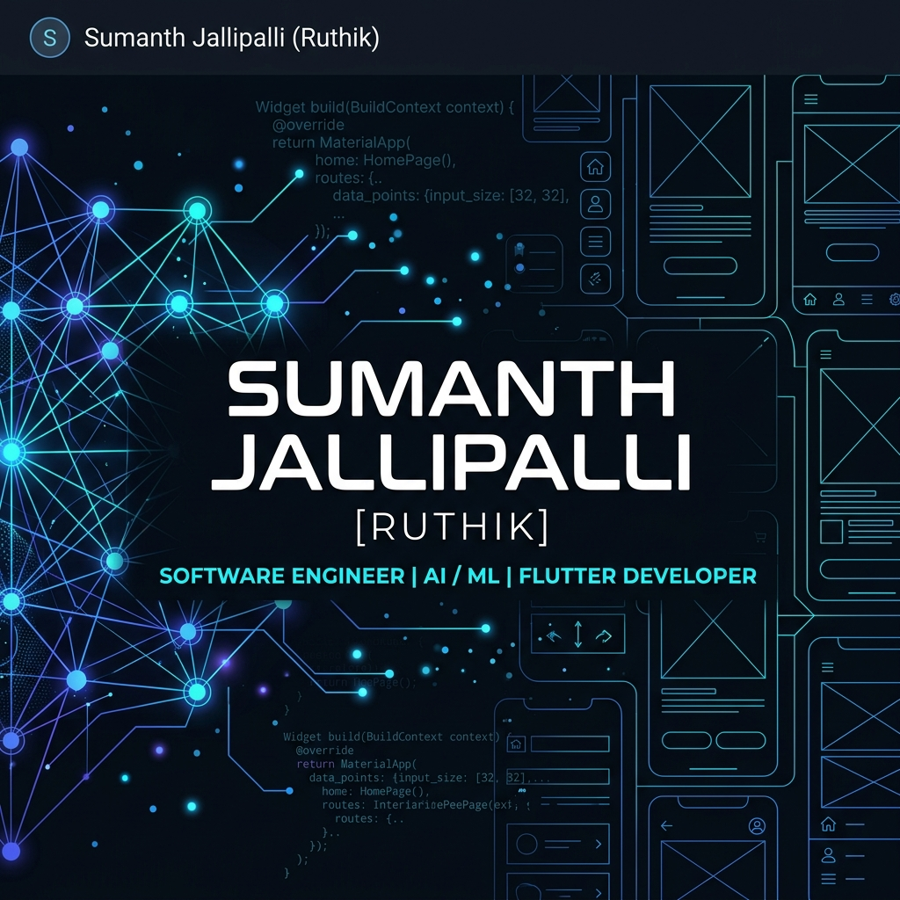

# Jallipalli Sumanth (Ruthik) 👋

  

  

  
  
  
  

---

## 🎯 Profile Overview

I am an **AI/ML Engineer & Flutter Mobile Developer** pursuing my B.Tech in Artificial Intelligence & Machine Learning at **Aditya Engineering College** (CGPA: **8.06/10.00**). I specialize in bridging the gap between intelligent machine learning models and high-performance cross-platform mobile applications.

- 🎓 **Education**: B.Tech in AI & ML, Aditya Engineering College (2023 – 2027)
- 💼 **Latest Role**: Full Stack Developer Intern (Flutter) at **Technical Hub**
- 🌟 **Core Focus**: Edge AI integration, cross-platform architecture, location-based services, and high-performance systems.
- 🚀 **Actively Seeking**: Software Engineering & Flutter Development Internships/Roles.

---

## 💼 Professional Experience

### 🚀 **Full Stack Developer Intern (Flutter)** | *Technical Hub, Surampalem, India*
**May 2026 – June 2026**
* **Project: CogniVision (AI Vision Aid)** — Assistive mobile application restoring environmental awareness and independent navigation for visually impaired individuals.
* ⚡ **On-Device Edge ML**: Integrated **Gemini 2.0 Live API** for low-latency visual streaming, paired with optimized YOLOv8n and MobileFaceNet TFLite models for real-time spatial object tracking and offline face recognition.
* 🗣️ **Voice Navigation**: Architected and built a fully voice-navigable interface enabling seamless hands-free usage.
* 🎙️ **Presentation**: Presented the completed product at **ProjectSpace 8.0** to multiple technical and business panels.

### 🚗 **Full Stack Developer Intern (Flutter)** | *Technical Hub, Surampalem, India*
**May 2025 – June 2025**
* **Project: Mecha-Connect (Roadside Assistance)** — On-demand roadside assistance mobile platform streamlining emergency support services for vehicle breakdowns.
* 📍 **Real-Time Geolocation**: Engineered active background location tracking with Google Maps API and geofencing to instantly match users with nearby verified service providers.
* 🤝 **Collaboration & Pitching**: Worked under industry mentorship and pitched the completed system at **ISHIP** to multiple tech teams.

---

## 🚀 Featured Projects

  <table border="0">
    <tr>
      <td width="50%" valign="top">
        

          <h3>👁️ CogniVision </h3>
          
Voice-navigable assistive Flutter mobile application integrated with Gemini 2.0 Live API and YOLOv8 for spatial awareness, helping visually impaired individuals recognize environment objects and faces.

          

            
          

          

            
            
            
          

        

      </td>
      <td width="50%" valign="top">
        

          <h3>🚗 Mecha-Connect </h3>
          
On-demand roadside assistance mobile platform streamlining emergency support for vehicle breakdowns. Integrates real-time background GPS tracking using Google Maps API.

          

            
          

          

            
            
            
          

        

      </td>
    </tr>
    <tr>
      <td width="50%" valign="top">
        

          <h3>💼 WorkNow </h3>
          
Highly responsive production-ready job search mobile application with dynamic location filtering and near-zero interaction latency built with modern material components.

          

            
          

          

            
            
          

        

      </td>
      <td width="50%" valign="top">
        

          <h3>🤝 Looking for Custom Solutions?</h3>
          
Explore my repositories featuring backend systems built on Node.js/Express, API integrations, database management systems, and academic AI projects!

           
          

            <a href="https://github.com/jruthik271?tab=repositories"><b>Explore all repositories ➡️</b></a>
          

        

      </td>
    </tr>
  </table>

---

## 🛠️ Technical Arsenal

  <table border="0">
    <tr>
      <td align="center" width="50%"><b>🚀 Languages</b></td>
      <td align="center" width="50%"><b>💻 Frameworks & Platforms</b></td>
    </tr>
    <tr>
      <td align="center">
        
        
        
        
      </td>
      <td align="center">
        
        
        
        
      </td>
    </tr>
    <tr>
      <td align="center"><b>🗄️ Databases</b></td>
      <td align="center"><b>🔧 Developer Tools</b></td>
    </tr>
    <tr>
      <td align="center">
        
        
        
      </td>
      <td align="center">
        
        
        
        
      </td>
    </tr>
  </table>
  
  

    <b>Core Fundamentals</b>: Data Structures & Algorithms (DSA) | Time & Space Complexity Analysis
  

---

## 🏆 Certifications & Achievements

  <table border="0">
    <tr>
      <td align="center" valign="bottom" width="33%">
        
          
        <a href="https://learn.microsoft.com/en-gb/users/sumanthjallipalli-5267/credentials/a37cfe252167acaa" target="_blank"><b>Verify GitHub Certification</b></a>
      </td>
      <td align="center" valign="bottom" width="33%">
        
          
        <a href="https://www.credly.com/badges/e90b26c1-89ac-4459-9b2d-7fef0d14cdb5/public_url" target="_blank"><b>Verify MongoDB Certification</b></a>
      </td>
      <td align="center" valign="bottom" width="33%">
        
          
        <a href="https://badges.parchment.com/public/assertions/yrqxl5_vTeKQHw6EUuhW7g?identity__email=jsumanth271@gmail.com" target="_blank"><b>Verify Postman Certification</b></a>
      </td>
    </tr>
  </table>

### 🌟 Additional Credentials & Achievements
- 🐍 **Cisco Networking Academy** – Python Essentials (1 & 2)
- 💻 **HackerRank Skill Badges**: Python (Basic), C (Basic), SQL (Basic), Problem Solving (Basic)

---

## 📊 Git & Coding Metrics

  
  

  
  
  

---

## 📫 Connect & Collaborate

I am always keen to collaborate on open-source projects, discuss Flutter and Dart architecture, or chat about AI agent systems. Let's connect!

* 📧 **Email**: [jruthik271@gmail.com](mailto:jruthik271@gmail.com)
* 💼 **LinkedIn**: [LinkedIn/Jallipalli Sumanth](https://www.linkedin.com/in/sumanth-jallipalli-a36174291/)
* 📞 **Phone**: +91 9491895027
* 📍 **Location**: Andhra Pradesh, India

  

  <i>“Keep building, keep learning.”</i> 🚀

